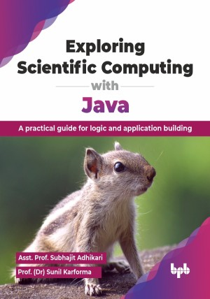

# Exploring Scientific Computing with Java

A practical guide for logic and application building.

This is the repository for [Exploring Scientific Computing with Java
](https://bpbonline.com/products/exploring-scientific-computing-with-java?variant=44130967224520),published by BPB Publications.

## About the Book
Java is a versatile programming language, ideal for scientific computing due to its robustness, platform independence, and extensive libraries. This book teaches you how to use Java for complex simulations and data analysis, empowering you to solve real-world problems and advance scientific research.

This Java programming book offers a thorough guide, starting with core concepts like data types, operators, and object-oriented programming (OOP). It then moves into advanced topics such as multithreading for handling multiple tasks at once, exception handling to manage runtime errors, and package management for organizing large codebases. You will also learn about input/output (I/O) operations to work with external data and applet development for creating small, interactive web programs. 

Building on your knowledge of Java programming and scientific computing, this book is a complete guide that equips you to delve into scientific computing and actively participate in innovative research and development.

## What You Will Learn
• Understand and code with data types, variables, arrays, and strings.

• Learn iterations, conditional statements, and how to apply them.

• Explore OOP with examples.

• Master multithreading for multi-tasking environments.

• Grasp Java exception handling and file management.
